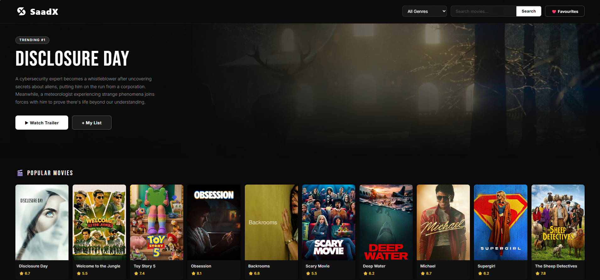
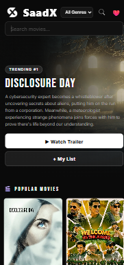

Yaar ghabrao mat! README.md khali ho gayi — bas wapas content paste karo!
README.md file mein yeh poora content paste karo:
markdown# 🎬 Movie Search App

A clean, responsive movie discovery web app built with vanilla HTML, CSS, and JavaScript — powered by the TMDB API.

🔗 **Live Demo:** [movie-search-website-three.vercel.app](https://movie-search-website-three.vercel.app/)

---

## 📸 Screenshots

### Desktop View

### Mobile View

---

## ✨ Features

- 🔥 **Trending Hero Section** — First popular movie displayed as a full-screen hero with backdrop
- 🎬 **Movie Grid** — Browse popular movies in a clean poster-style grid
- 🔍 **Search** — Search any movie by name using TMDB search API
- 🎭 **Genre Filter** — Filter movies by genre (Action, Comedy, Horror, etc.)
- ▶️ **Trailer Popup** — Watch YouTube trailers directly inside the app
- ❤️ **Favourites** — Save movies to your personal list using LocalStorage
- 📱 **Fully Responsive** — Works on mobile, tablet, and desktop

---

## 🛠️ Tech Stack

| Technology           | Usage                 |
| -------------------- | --------------------- |
| HTML5                | Structure             |
| CSS3                 | Styling & Animations  |
| JavaScript (Vanilla) | Logic & API calls     |
| TMDB API             | Movie data & trailers |
| LocalStorage         | Saving favourites     |
| Vercel               | Deployment            |

---

## 📁 Project Structure

    movie-search-app/
    │
    ├── index.html
    ├── style.css
    ├── responsive.css
    │
    ├── js/
    │   ├── config.js
    │   ├── movies.js
    │   ├── trailer.js
    │   ├── favourites.js
    │   └── responsive.js
    │
    └── screenshots/
        ├── desktop.png
        └── mobile.png

---

## 🚀 How It Works

1. On load — TMDB API se popular movies fetch hoti hain
2. First movie hero section mein display hoti hai
3. Baaki saari movies poster grid mein dikhti hain
4. Search ya genre filter karo — naye results aate hain
5. Trailer button dabao — YouTube embed modal mein khulta hai
6. Favourites button dabao — LocalStorage mein save hota hai

---

## 🔑 API Used

**TMDB (The Movie Database)**

- Free API — [developers.themoviedb.org](https://developers.themoviedb.org)
- Endpoints used:
  - `/movie/popular` — Popular movies
  - `/search/movie` — Search
  - `/genre/movie/list` — Genres
  - `/movie/{id}/videos` — Trailers

---

## 👨‍💻 Author

**Muhammad Saad**

- GitHub: [@MuhammadSaad-55](https://github.com/MuhammadSaad-55)

---

⭐ **If you like this project, give it a star!**
